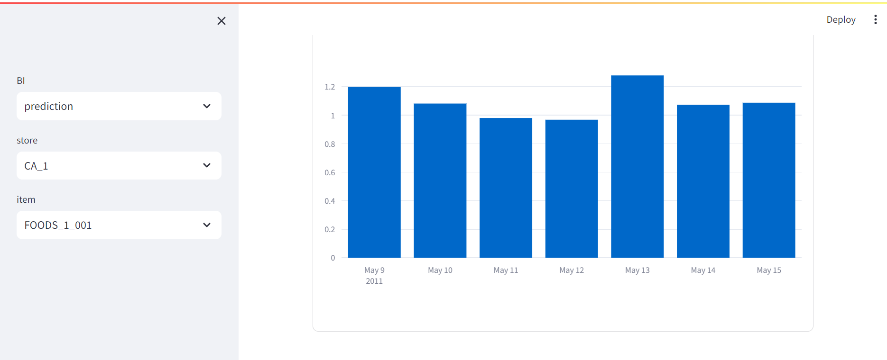

# demand-forecasting-m5

本リポジトリは機械学習パイプライン（データ取得、前処理、学習、評価、予測）を実行する機械学習システムの需要予測テンプレートです。テンプレートは時系列データを用いて、店舗ごとに予測モデルを作成、店舗/品目/日付の粒度で売上数量を需要予測します。


## データ

データは[Kaggleが提供するM5 Forecasting - Accuracy](https://www.kaggle.com/competitions/m5-forecasting-accuracy)のデータセットを使用します。

- テンプレートは1日～100日の過去実績の売上数量を学習、101日～107日の売上数量を予測します。

- データセットは店舗/品目/日付ごとの売上数量（sales）、週次の店舗/品目ごとの価格（prices）、日付ごとのイベントカレンダー（calendar）の3つです。
  - `sales`: 店舗ID`store_id`、品目ID`item_id`、日付ID`date_id`ごとの売上数量`sales`を格納したトランザクションデータ

  - `prices`: 店舗ID`store_id`、品目ID`item_id`,
  週次ID``wm_yr_wk``ごとの価格`sell_price`を持つマスタデータ 
  
  - `calendar`: 日付`date`と日付ID`date_id`と週次ID`wm_yr_wk`の紐づけと日付ごとのイベントフラグを持つマスタデータ


- Kaggleのsalesのレコード件数は100万件を超えますが、テンプレートは処理高速化のため、件数を約12万件に絞ったデモデータを使用します。同様に、pricesのレコード件数も約23万件に絞ります。

- デモデータは[kaggleのデータセット](https://www.kaggle.com/competitions/m5-forecasting-accuracy/data)を以下の仕様で加工し、[data](./data/)に格納済みです。デモデータの作成方法は[notebook](./notebook/)を参照してください。
  - `sales_demo.csv`
    - 元ファイルは`sales_train_evaluation.csv`
    - `store_id`を`CA_1`, `CA_2`で絞り込み
    - `item_id`を`FOODS_1`, `FOODS_2`で絞り込み
    - `date_id`を文字列`d_xxx`から数値`xxx`に変換し、1～100で絞り込み
    - 売上数量の列を横持から縦持ちに変換し`sales`の列を追加（レコード件数：122,800=店舗数：2×品目数：614×日付数：100）
  - `prices_demo.csv`
    - 元ファイルは`sell_prices.csv`
    - `store_id`を`CA_1`, `CA_2`で絞り込み
    - `item_id`を`FOODS_1`, `FOODS_2`で絞り込み
  - `calendar_demo.csv`
    - 元ファイルは`calendar.csv`
    - 列名を`d`から`date_id`に変更し、文字列`d_xxx`から数値`xxx`に変換

 - 学習データはsalesにcalendar、pricesの順で結合して作成する。（pricesの結合時にcalendarが持つ週次ID`wm_yr_wk`をキーに使用するため先にcalendarを結合する。）


 - 学習はcsvファイルを直接利用するのではなく、データベース(DB)に登録します。スキーマは[create.sql](./data/create.sql)で定義しています。


## Components

テンプレートは以下のコンポーネントで構成されています。

- PostgreSQL database: データを管理するデータベース。テンプレートで使用するデータおよびMLflow tracking serverのデータを記録する。
- [mlflow](./mlflow/): 機械学習の学習、評価、予測を記録し、webブラウザで結果を表示します。
- [data_registration](./data_registration/): [Kaggleが提供するM5 Forecasting - Accuracy](https://www.kaggle.com/competitions/m5-forecasting-accuracy)のデータをPostgreSQLに登録するバッチ処理。
- [machine_learning](./machine_learning/): 機械学習開発のためのテンプレートとして例示したプログラム。PostgreSQLからデータを取得し、前処理、学習、評価、予測を実行し、記録をMLflow tracking serverに記録する。
- [bi](./bi/): 過去実績の売上数量と機械学習で得られた予測の売上数量をデータベースから取得し、[Streamlit](https://streamlit.io/)で可視化します。
- [notebook](./notebook/): 本リポジトリの実装前に[Google Colaboratory](https://colab.google/)で動作確認したnotebookを格納しています。本システムの実行結果はnotebookの予測値と一致します。

## machine_learningの構成

[machine_learning](./machine_learning/)は主に以下のツールを使用しています。他にも補助的なライブラリは使用していますが、煩雑になるため省略しています。機械学習で用いる各種パラメータは[hydra](machine_learning/hydra/)で管理します。


- 機械学習
  - [pandas](https://pandas.pydata.org/): データフレームのライブラリ。本テンプレートで使用するデータは基本的にpandas DataFrame形式で管理される。
  - [pandera](https://pandera.readthedocs.io/en/stable/): pandas DataFrameのデータを検査するライブラリ
  - [scikit-learn](https://scikit-learn.org/stable/): テーブルデータの機械学習の前処理及びアルゴリズムを提供するライブラリ
  - [LightGBM](https://lightgbm.readthedocs.io/en/latest/index.html): 勾配ブースティングのアルゴリズムを提供するライブラリ、実装はscikit-learn APIを使用する。
- 機械学習の管理
  - [MLflow](https://mlflow.org/): 機械学習の学習パラメータ及び実行結果を管理するライブラリ
  - [Hydra](https://hydra.cc/): 機械学習のパラメータを管理するライブラリ
- リポジトリのライブラリ管理
  - [poetry](https://python-poetry.org/): Pythonのライブラリを管理する。

[machine_learning](./machine_learning/)のプログラムはレイヤードアーキテクチャを採用。クラスを抽象クラスと具象クラスに分けて実装、コンポーネントの依存が一方向になるよう整理しています。
プログラムは以下のコンポーネントで構成されています。

- [main.py](machine_learning/src/main.py): クラスを初期化し、usecaseのメソッドを実行
- [usecase](machine_learning/src/usecase/): 機械学習パイプラインの各処理（データ取得、前処理、学習、評価、予測）
- [domain](machine_learning/src/domain/): usecase間で受け渡すドメインオブジェクトのデータ型
- [ml_algos](machine_learning/src/ml_algos/): 機械学習の各種アルゴリズム
- [repository](machine_learning/src/repository/): データベースへのリクエスト
- [schema](machine_learning/src/schema/): データベースから取得するデータ型
- [infrastructure](machine_learning/src/infrastructure/): 外部データベースへのアクセス


（注）図はrepositoryだけ具象と抽象を分けて記載してますが、infrastructureとml_algosも具象クラスと抽象クラスに分けて実装しています。

## Requirements

- Docker
- Docker compose
- Poetry（ライブラリ更新時に必要、処理実行するだけであれば不要）
- makeコマンドの実行環境

```sh
# makeのインストール(実行時にsudoパスワードを入力)
$ sudo apt update
$ sudo apt install make
$ make --version
GNU Make 4.3
```

## Getting started

### 1. Docker imageのビルド
- 本リポジトリのルートディレクトリに移動します。

```sh
# 現在のディレクトリの表示(「/xxx/repository」はユーザにより異なります。)
$ pwd
/home/xxx/repository/demand-forecasting-m5
```

- Dockerファイルは3つあり、[makefile](./makefile)の`make build_all`は全てのDockerをまとめてビルドします。

```sh
# 全てのDockerfileを一括でビルド
$ make build_all
```

<details> <summary>make build_all実行ログ</summary>

```sh
$ make build_all
docker build \
        --platform linux/amd64 \
        -t demand_forecasting_m5:demand_forecasting_m5_data_registration_1.0.0 \
        -f /home/xxx/repository/demand-forecasting-m5/data_registration/Dockerfile \
        .
[+] Building 35.9s (10/10) FINISHED                                                                          docker:default
 => [internal] load .dockerignore                                                                                      0.0s
 => => transferring context: 2B                                                                                        0.0s
 => [internal] load build definition from Dockerfile                                                                   0.1s
 => => transferring dockerfile: 464B                                                                                   0.0s
 => [internal] load metadata for docker.io/library/python:3.10.6-slim                                                  1.9s
 => [1/5] FROM docker.io/library/python:3.10.6-slim@sha256:dff7fd9200421a8c65e020af221a21c8aab784c5c8a8d55c64a095b645  0.2s
 => => resolve docker.io/library/python:3.10.6-slim@sha256:dff7fd9200421a8c65e020af221a21c8aab784c5c8a8d55c64a095b645  0.0s
 => => sha256:af1108142cf5dcd629f5542acc4dd4cc055d658821016362fef6dd4759dc9e9f 7.50kB / 7.50kB                         0.0s
 => => sha256:dff7fd9200421a8c65e020af221a21c8aab784c5c8a8d55c64a095b645209d77 1.86kB / 1.86kB                         0.0s
 => => sha256:c8ef926b002a8371fff6b4f40142dcc6d6f7e217f7afce2c2d1ed2e6c28e2b7c 1.37kB / 1.37kB                         0.0s
 => [internal] load build context                                                                                      0.0s
 => => transferring context: 80.61kB                                                                                   0.0s
 => [2/5] WORKDIR /opt                                                                                                 0.0s
 => [3/5] COPY data_registration/requirements.txt /opt/                                                                0.0s
 => [4/5] RUN apt-get -y update &&     apt-get -y install     apt-utils     gcc g++ &&     apt-get clean &&     rm -  31.9s
 => [5/5] COPY data_registration/src/ /opt/src/                                                                        0.0s
 => exporting to image                                                                                                 1.7s
 => => exporting layers                                                                                                1.7s
 => => writing image sha256:931d9f32b572e1657c01c2d9a977b077d4927042403cb0c2b9e4a6ddbabf34e5                           0.0s
 => => naming to docker.io/library/demand_forecasting_m5:demand_forecasting_m5_data_registration_1.0.0                 0.0s

What's Next?
  View a summary of image vulnerabilities and recommendations → docker scout quickview
docker build \
        --platform linux/amd64 \
        -t demand_forecasting_m5:demand_forecasting_m5_machine_learning_1.0.0 \
        -f /home/xxx/repository/demand-forecasting-m5/machine_learning/Dockerfile \
        .
[+] Building 109.0s (11/11) FINISHED                                                                         docker:default
 => [internal] load .dockerignore                                                                                      0.0s
 => => transferring context: 2B                                                                                        0.0s
 => [internal] load build definition from Dockerfile                                                                   0.0s
 => => transferring dockerfile: 511B                                                                                   0.0s
 => [internal] load metadata for docker.io/library/python:3.10.6-slim                                                  0.7s
 => [1/6] FROM docker.io/library/python:3.10.6-slim@sha256:dff7fd9200421a8c65e020af221a21c8aab784c5c8a8d55c64a095b645  0.0s
 => [internal] load build context                                                                                      0.0s
 => => transferring context: 231.80kB                                                                                  0.0s
 => CACHED [2/6] WORKDIR /opt                                                                                          0.0s
 => [3/6] COPY machine_learning/requirements.txt /opt/                                                                 0.0s
 => [4/6] RUN apt-get -y update &&     apt-get -y install     apt-utils     gcc g++ &&     apt-get clean &&     rm   101.2s
 => [5/6] COPY machine_learning/src/ /opt/src/                                                                         0.1s
 => [6/6] COPY machine_learning/hydra/ /opt/hydra/                                                                     0.0s
 => exporting to image                                                                                                 6.8s
 => => exporting layers                                                                                                6.8s
 => => writing image sha256:e7076249c0133611d105a19e33d60995faeff1ec3118e42add075add59bf788d                           0.0s
 => => naming to docker.io/library/demand_forecasting_m5:demand_forecasting_m5_machine_learning_1.0.0                  0.0s

What's Next?
  View a summary of image vulnerabilities and recommendations → docker scout quickview
docker build \
        --platform linux/amd64 \
        -t demand_forecasting_m5:demand_forecasting_m5_mlflow_1.0.0 \
        -f /home/xxx/repository/demand-forecasting-m5/mlflow/Dockerfile \
        .
[+] Building 111.2s (9/9) FINISHED                                                                           docker:default
 => [internal] load .dockerignore                                                                                      0.0s
 => => transferring context: 2B                                                                                        0.0s
 => [internal] load build definition from Dockerfile                                                                   0.0s
 => => transferring dockerfile: 394B                                                                                   0.0s
 => [internal] load metadata for docker.io/library/python:3.10.6-slim                                                  1.6s
 => [1/4] FROM docker.io/library/python:3.10.6-slim@sha256:dff7fd9200421a8c65e020af221a21c8aab784c5c8a8d55c64a095b645  0.0s
 => [internal] load build context                                                                                      0.0s
 => => transferring context: 4.65kB                                                                                    0.0s
 => CACHED [2/4] WORKDIR /opt                                                                                          0.0s
 => [3/4] COPY mlflow/requirements.txt /opt/                                                                           0.1s
 => [4/4] RUN pip install --no-cache-dir -r requirements.txt                                                         103.4s
 => exporting to image                                                                                                 6.0s
 => => exporting layers                                                                                                6.0s
 => => writing image sha256:4b13438318a380f81837b833708bb9b6cddc2adfebb280a4441a29c4895179c4                           0.0s
 => => naming to docker.io/library/demand_forecasting_m5:demand_forecasting_m5_mlflow_1.0.0                            0.0s

What's Next?
  View a summary of image vulnerabilities and recommendations → docker scout quickview
docker build \
        --platform linux/amd64 \
        -t demand_forecasting_m5:demand_forecasting_m5_bi_1.0.0 \
        -f /home/xxx/repository/demand-forecasting-m5/bi/Dockerfile \
        .
[+] Building 109.8s (10/10) FINISHED                                                                         docker:default
 => [internal] load build definition from Dockerfile                                                                   0.1s
 => => transferring dockerfile: 492B                                                                                   0.0s
 => [internal] load .dockerignore                                                                                      0.0s
 => => transferring context: 2B                                                                                        0.0s
 => [internal] load metadata for docker.io/library/python:3.10.6-slim                                                  0.9s
 => [1/5] FROM docker.io/library/python:3.10.6-slim@sha256:dff7fd9200421a8c65e020af221a21c8aab784c5c8a8d55c64a095b645  0.0s
 => [internal] load build context                                                                                      0.0s
 => => transferring context: 33.12kB                                                                                   0.0s
 => CACHED [2/5] WORKDIR /opt                                                                                          0.0s
 => [3/5] COPY bi/requirements.txt /opt/                                                                               0.1s
 => [4/5] RUN apt-get -y update &&     apt-get -y install     apt-utils     gcc g++ &&     apt-get clean &&     rm   101.1s
 => [5/5] COPY bi/src/ /opt/src/                                                                                       0.0s
 => exporting to image                                                                                                 7.6s
 => => exporting layers                                                                                                7.6s
 => => writing image sha256:8045fcf658472308625dec7f945e87194e39012d1b2f8d016f43fe286b0e1720                           0.0s
 => => naming to docker.io/library/demand_forecasting_m5:demand_forecasting_m5_bi_1.0.0                                0.0s

What's Next?
  View a summary of image vulnerabilities and recommendations → docker scout quickview
```
</details>

- Dockerファイルは個別にビルドすることも可能です。

```sh
# data_registrationのビルド
$ make build_data_registration
docker build \
        --platform linux/amd64 \
        -t demand_forecasting_m5:demand_forecasting_m5_data_registration_1.0.0 \
        -f /home/xxx/repository/demand-forecasting-m5/data_registration/Dockerfile \

# machine_learningのビルド
$ make build_machine_learning
docker build \
        --platform linux/amd64 \
        -t demand_forecasting_m5:demand_forecasting_m5_machine_learning_1.0.0 \
        -f /home/xxx/repository/demand-forecasting-m5/machine_learning/Dockerfile \

# mlflowのビルド
$ make build_mlflow
docker build \
        --platform linux/amd64 \
        -t demand_forecasting_m5:demand_forecasting_m5_mlflow_1.0.0 \
        -f /home/xxx/repository/demand-forecasting-m5/mlflow/Dockerfile \

# biのビルド
$ make build_bi
docker build \
        --platform linux/amd64 \
        -t demand_forecasting_m5:demand_forecasting_m5_bi_1.0.0 \
        -f /home/xxx/repository/demand-forecasting-m5/bi/Dockerfile \
```

- ビルドしたDocker imageを確認します。

```sh
# Docker imageの確認
$ docker images
REPOSITORY                   TAG                                                      IMAGE ID       CREATED         SIZE
demand_forecasting_m5        demand_forecasting_m5_bi_1.0.0                           8045fcf65847   2 minutes ago   825MB
demand_forecasting_m5        demand_forecasting_m5_mlflow_1.0.0                       4b13438318a3   4 minutes ago   836MB
demand_forecasting_m5        demand_forecasting_m5_machine_learning_1.0.0             e7076249c013   6 minutes ago   1.04GB
demand_forecasting_m5        demand_forecasting_m5_data_registration_1.0.0            931d9f32b572   7 minutes ago   378MB
```
### 2. 事前準備

- Docker composeでPosgreSQL database、MLflow、data registration、BIのコンテナを起動します。
- [makefile](./makefile)の`make up`は[docker-compose.yaml](docker-compose.yaml)の処理をまとめて実行します。

```sh
# docker-composeの起動
$ make up
docker compose \
        -f docker-compose.yaml \
        up -d
[+] Running 5/5
 ✔ Network demand_forecasting_m5  Created                                                                              0.0s
 ✔ Container postgres             Started                                                                              0.1s
 ✔ Container mlflow               Started                                                                              0.1s
 ✔ Container data_registration    Started                                                                              0.1s
 ✔ Container bi                   Started                                                                              0.1s
```

- data registrationが学習で使用するデータをPostgreSQL databaseに登録します。登録状況は実行ログをご確認ください。
<details> <summary>DB構築とテーブル登録実行ログ</summary>

```sh
# 起動したDocker containerの確認
$ docker ps -a
CONTAINER ID   IMAGE                                                                 COMMAND                  CREATED         STATUS                          PORTS                     NAMES
26bf000e4a65   demand_forecasting_m5:demand_forecasting_m5_bi_1.0.0                  "/bin/sh -c 'sleep 2…"   4 minutes ago   Up 4 minutes                    0.0.0.0:8501->8501/tcp    bi
c8a0b769145d   demand_forecasting_m5:demand_forecasting_m5_data_registration_1.0.0   "/bin/sh -c 'sleep 1…"   4 minutes ago   Exited (0) About a minute ago                             data_registration
08b2fbc7bade   demand_forecasting_m5:demand_forecasting_m5_mlflow_1.0.0              "mlflow server --bac…"   4 minutes ago   Up 4 minutes                    0.0.0.0:15000->5000/tcp   mlflow
9cb98874e348   postgres:14.3                                                         "docker-entrypoint.s…"   4 minutes ago   Up 4 minutes                    0.0.0.0:5432->5432/tcp    postgres


# テーブル登録のログ
$ docker logs -f data_registration
/usr/local/lib/python3.10/site-packages/pydantic/_internal/_config.py:322: UserWarning: Valid config keys have changed in V2:
* 'allow_mutation' has been removed
  warnings.warn(message, UserWarning)
[2024-02-18 03:57:00,861] [INFO] [__main__] [main.py:43] [main] START data_registration
[2024-02-18 03:57:00,861] [INFO] [__main__] [main.py:44] [main]
options:
create_sql_filepath: /opt/data/create.sql
calendar_filepath: /opt/data/calendar_demo.csv
prices_filepath: /opt/data/prices_demo.csv
sales_filepath: /opt/data/sales_demo.csv

[2024-02-18 03:57:00,861] [INFO] [__main__] [main.py:70] [main] create table
[2024-02-18 03:57:00,861] [DEBUG] [src.infrastructure.database] [database.py:62] [execute_create_query] create query: CREATE TABLE IF NOT EXISTS calendar (
    date VARCHAR(255) NOT NULL,
    wm_yr_wk INTEGER NOT NULL,
    weekday VARCHAR(255) NOT NULL,
    wday INTEGER NOT NULL,
    month INTEGER NOT NULL,
    year INTEGER NOT NULL,
    date_id INTEGER NOT NULL,
    event_name_1 VARCHAR(255),
    event_type_1 VARCHAR(255),
    event_name_2 VARCHAR(255),
    event_type_2 VARCHAR(255),
    snap_ca INTEGER NOT NULL,
    snap_tx INTEGER NOT NULL,
    snap_wi INTEGER NOT NULL,
    created_at TIMESTAMP WITH TIME ZONE DEFAULT CURRENT_TIMESTAMP NOT NULL,
    PRIMARY KEY (date)
);


CREATE TABLE IF NOT EXISTS prices (
    key VARCHAR(255) NOT NULL,
    store_id VARCHAR(255) NOT NULL,
    item_id VARCHAR(255) NOT NULL,
    wm_yr_wk INTEGER NOT NULL,
    sell_price FLOAT NOT NULL,
    created_at TIMESTAMP WITH TIME ZONE DEFAULT CURRENT_TIMESTAMP NOT NULL,
    PRIMARY KEY (key)
);


CREATE TABLE IF NOT EXISTS sales (
    key VARCHAR(255) NOT NULL,
    id VARCHAR(255) NOT NULL,
    item_id VARCHAR(255) NOT NULL,
    dept_id VARCHAR(255) NOT NULL,
    cat_id VARCHAR(255) NOT NULL,
    store_id VARCHAR(255) NOT NULL,
    state_id VARCHAR(255) NOT NULL,
    date_id INTEGER NOT NULL,
    sales FLOAT NOT NULL,
    created_at TIMESTAMP WITH TIME ZONE DEFAULT CURRENT_TIMESTAMP NOT NULL,
    PRIMARY KEY (key)
);


CREATE TABLE IF NOT EXISTS prediction (
    store_id VARCHAR(255) NOT NULL,
    item_id VARCHAR(255) NOT NULL,
    date_id INTEGER NOT NULL,
    prediction FLOAT NOT NULL,
    created_at TIMESTAMP WITH TIME ZONE DEFAULT CURRENT_TIMESTAMP NOT NULL,
    PRIMARY KEY (store_id, item_id, date_id)
);
, parameters: None
[2024-02-18 03:57:00,961] [INFO] [__main__] [main.py:72] [main] done create table
[2024-02-18 03:57:00,961] [INFO] [__main__] [main.py:74] [main] register calendar
[2024-02-18 03:57:01,034] [INFO] [src.usecase.data_register_usecase] [data_register_usecase.py:71] [register_calendar] calendar: 1000 ...
[2024-02-18 03:57:01,130] [INFO] [src.usecase.data_register_usecase] [data_register_usecase.py:74] [register_calendar] calendar: 1969 ...
[2024-02-18 03:57:01,132] [INFO] [__main__] [main.py:76] [main] done register calendar
[2024-02-18 03:57:01,132] [INFO] [__main__] [main.py:78] [main] register prices
[2024-02-18 03:57:02,040] [INFO] [src.usecase.data_register_usecase] [data_register_usecase.py:99] [register_prices] prices: 10000 ...
[2024-02-18 03:57:02,847] [INFO] [src.usecase.data_register_usecase] [data_register_usecase.py:99] [register_prices] prices: 20000 ...
[2024-02-18 03:57:04,021] [INFO] [src.usecase.data_register_usecase] [data_register_usecase.py:99] [register_prices] prices: 30000 ...
[2024-02-18 03:57:05,414] [INFO] [src.usecase.data_register_usecase] [data_register_usecase.py:99] [register_prices] prices: 40000 ...
[2024-02-18 03:57:07,016] [INFO] [src.usecase.data_register_usecase] [data_register_usecase.py:99] [register_prices] prices: 50000 ...
[2024-02-18 03:57:09,054] [INFO] [src.usecase.data_register_usecase] [data_register_usecase.py:99] [register_prices] prices: 60000 ...
[2024-02-18 03:57:11,359] [INFO] [src.usecase.data_register_usecase] [data_register_usecase.py:99] [register_prices] prices: 70000 ...
[2024-02-18 03:57:13,891] [INFO] [src.usecase.data_register_usecase] [data_register_usecase.py:99] [register_prices] prices: 80000 ...
[2024-02-18 03:57:16,816] [INFO] [src.usecase.data_register_usecase] [data_register_usecase.py:99] [register_prices] prices: 90000 ...
[2024-02-18 03:57:20,077] [INFO] [src.usecase.data_register_usecase] [data_register_usecase.py:99] [register_prices] prices: 100000 ...
[2024-02-18 03:57:23,549] [INFO] [src.usecase.data_register_usecase] [data_register_usecase.py:99] [register_prices] prices: 110000 ...
[2024-02-18 03:57:27,111] [INFO] [src.usecase.data_register_usecase] [data_register_usecase.py:99] [register_prices] prices: 120000 ...
[2024-02-18 03:57:31,217] [INFO] [src.usecase.data_register_usecase] [data_register_usecase.py:99] [register_prices] prices: 130000 ...
[2024-02-18 03:57:35,934] [INFO] [src.usecase.data_register_usecase] [data_register_usecase.py:99] [register_prices] prices: 140000 ...
[2024-02-18 03:57:40,644] [INFO] [src.usecase.data_register_usecase] [data_register_usecase.py:99] [register_prices] prices: 150000 ...
[2024-02-18 03:57:45,589] [INFO] [src.usecase.data_register_usecase] [data_register_usecase.py:99] [register_prices] prices: 160000 ...
[2024-02-18 03:57:51,117] [INFO] [src.usecase.data_register_usecase] [data_register_usecase.py:99] [register_prices] prices: 170000 ...
[2024-02-18 03:57:56,804] [INFO] [src.usecase.data_register_usecase] [data_register_usecase.py:99] [register_prices] prices: 180000 ...
[2024-02-18 03:58:02,888] [INFO] [src.usecase.data_register_usecase] [data_register_usecase.py:99] [register_prices] prices: 190000 ...
[2024-02-18 03:58:09,089] [INFO] [src.usecase.data_register_usecase] [data_register_usecase.py:99] [register_prices] prices: 200000 ...
[2024-02-18 03:58:15,610] [INFO] [src.usecase.data_register_usecase] [data_register_usecase.py:99] [register_prices] prices: 210000 ...
[2024-02-18 03:58:22,530] [INFO] [src.usecase.data_register_usecase] [data_register_usecase.py:99] [register_prices] prices: 220000 ...
[2024-02-18 03:58:29,922] [INFO] [src.usecase.data_register_usecase] [data_register_usecase.py:99] [register_prices] prices: 230000 ...
[2024-02-18 03:58:37,426] [INFO] [src.usecase.data_register_usecase] [data_register_usecase.py:102] [register_prices] prices: 236880 ...
[2024-02-18 03:58:37,530] [INFO] [__main__] [main.py:80] [main] done register prices
[2024-02-18 03:58:37,530] [INFO] [__main__] [main.py:82] [main] register sales
[2024-02-18 03:58:38,498] [INFO] [src.usecase.data_register_usecase] [data_register_usecase.py:131] [register_sales] sales: 10000 ...
[2024-02-18 03:58:39,460] [INFO] [src.usecase.data_register_usecase] [data_register_usecase.py:131] [register_sales] sales: 20000 ...
[2024-02-18 03:58:40,835] [INFO] [src.usecase.data_register_usecase] [data_register_usecase.py:131] [register_sales] sales: 30000 ...
[2024-02-18 03:58:42,690] [INFO] [src.usecase.data_register_usecase] [data_register_usecase.py:131] [register_sales] sales: 40000 ...
[2024-02-18 03:58:45,077] [INFO] [src.usecase.data_register_usecase] [data_register_usecase.py:131] [register_sales] sales: 50000 ...
[2024-02-18 03:58:47,696] [INFO] [src.usecase.data_register_usecase] [data_register_usecase.py:131] [register_sales] sales: 60000 ...
[2024-02-18 03:58:50,921] [INFO] [src.usecase.data_register_usecase] [data_register_usecase.py:131] [register_sales] sales: 70000 ...
[2024-02-18 03:58:54,410] [INFO] [src.usecase.data_register_usecase] [data_register_usecase.py:131] [register_sales] sales: 80000 ...
[2024-02-18 03:58:58,565] [INFO] [src.usecase.data_register_usecase] [data_register_usecase.py:131] [register_sales] sales: 90000 ...
[2024-02-18 03:59:02,961] [INFO] [src.usecase.data_register_usecase] [data_register_usecase.py:131] [register_sales] sales: 100000 ...
[2024-02-18 03:59:07,731] [INFO] [src.usecase.data_register_usecase] [data_register_usecase.py:131] [register_sales] sales: 110000 ...
[2024-02-18 03:59:13,083] [INFO] [src.usecase.data_register_usecase] [data_register_usecase.py:131] [register_sales] sales: 120000 ...
[2024-02-18 03:59:18,463] [INFO] [src.usecase.data_register_usecase] [data_register_usecase.py:134] [register_sales] sales: 122800 ...
[2024-02-18 03:59:18,543] [INFO] [__main__] [main.py:84] [main] done register sales
[2024-02-18 03:59:18,543] [INFO] [__main__] [main.py:87] [main] DONE data_registration
```
</details>

  - DBにログインして、SQLを実行することもできます。

<details> <summary>DBログインとSQL実行ログ</summary>

```sh
# postgresコンテナに入る
$ docker exec -it postgres bash
root@postgres:/#

# DBログイン　パスワード入力が求められるので　password　を入力
root@postgres:/# psql -h localhost -p 5432 -U postgres demand_forecasting_m5 -W
Password:

# テーブル一覧
demand_forecasting_m5=# \dt
           List of relations
 Schema |    Name    | Type  |  Owner
--------+------------+-------+----------
 public | calendar   | table | postgres
 public | prediction | table | postgres
 public | prices     | table | postgres
 public | sales      | table | postgres
(4 rows)

# SQL実行
demand_forecasting_m5=# select count(*) from sales;
 count
--------
 122800
(1 row)

# DBログアウト
demand_forecasting_m5=# \q

# postgresコンテナから抜ける
root@postgres:/# exit
exit
$
```
</details>


### 3. 機械学習パイプラインの実行

- 機械学習パイプラインはDockerコンテナを起動して実行します。[makefile](./makefile)の`run_machine_learning`は機械学習パイプラインのジョブを一度に実行します。

- ジョブ実行は「２．事前準備」のテーブルの登録処理が完了してから実行してください。テーブルへの登録状況は「DB構築とテーブル登録実行ログ」で確認できます。

- 予測モデルは店舗ごとに作成し、学習データには`CA_1`, `CA_2`の2店舗があるので、2モデル作成します。

- 前処理のcsvファイル、モデル、ハイパーパラメータ、予測値のcsvファイルはMLflowに格納します。

- 予測値はテーブル`prediction`にも登録します。

- 下記のコマンドはローカルの`hydra`と`src`を使用して実行します。Docker build時点の`hydra`と`src`を使用する場合、以下のマウントを削除して実行してください。
  - -v /home/xxx/repository/demand-forecasting-m5/machine_learning/hydra:/opt/hydra
  - -v /home/xxx/repository/demand-forecasting-m5/machine_learning/src:/opt/src

```sh
$ make run_machine_learning
docker run \
        -it \
        --name machine_learning \
        -e POSTGRES_HOST=postgres \
        -e POSTGRES_PORT=5432 \
        -e POSTGRES_USER=postgres \
        -e POSTGRES_PASSWORD=password \
        -e POSTGRES_DBNAME=demand_forecasting_m5 \
        -e MLFLOW_TRACKING_URI=http://mlflow:5000 \
        -e TARGET_CONFIG=default \
        -v /home/xxx/repository/demand-forecasting-m5/machine_learning/hydra:/opt/hydra \
        -v /home/xxx/repository/demand-forecasting-m5/machine_learning/src:/opt/src \
        -v /home/xxx/repository/demand-forecasting-m5/machine_learning/outputs:/opt/outputs \
        --net demand_forecasting_m5 \
        demand_forecasting_m5:demand_forecasting_m5_machine_learning_1.0.0 \
        python -m src.main
```

<details> <summary>make run_machine_learning実行ログ</summary>

```sh
$ make run_machine_learning
docker run \
        -it \
        --name machine_learning \
        -e POSTGRES_HOST=postgres \
        -e POSTGRES_PORT=5432 \
        -e POSTGRES_USER=postgres \
        -e POSTGRES_PASSWORD=password \
        -e POSTGRES_DBNAME=demand_forecasting_m5 \
        -e MLFLOW_TRACKING_URI=http://mlflow:5000 \
        -e TARGET_CONFIG=default \
        -v /home/xxx/repository/demand-forecasting-m5/machine_learning/hydra:/opt/hydra \
        -v /home/xxx/repository/demand-forecasting-m5/machine_learning/src:/opt/src \
        -v /home/xxx/repository/demand-forecasting-m5/machine_learning/outputs:/opt/outputs \
        --net demand_forecasting_m5 \
        demand_forecasting_m5:demand_forecasting_m5_machine_learning_1.0.0 \
        python -m src.main
/usr/local/lib/python3.10/site-packages/pydantic/_internal/_config.py:322: UserWarning: Valid config keys have changed in V2:
* 'allow_mutation' has been removed
  warnings.warn(message, UserWarning)
/usr/local/lib/python3.10/site-packages/pydantic/_internal/_config.py:322: UserWarning: Valid config keys have changed in V2:
* 'allow_mutation' has been removed
  warnings.warn(message, UserWarning)
/opt/src/main.py:29: UserWarning:
The version_base parameter is not specified.
Please specify a compatability version level, or None.
Will assume defaults for version 1.1
  @hydra.main(
/usr/local/lib/python3.10/site-packages/hydra/_internal/hydra.py:119: UserWarning: Future Hydra versions will no longer change working directory at job runtime by default.
See https://hydra.cc/docs/1.2/upgrades/1.1_to_1.2/changes_to_job_working_dir/ for more information.
  ret = run_job(
[2024-02-18 04:03:46,889][__main__][INFO] - START machine_learning...
[2024-02-18 04:03:46,889][__main__][INFO] - config: {'name': 'demand_forecasting_m5', 'model': {'name': 'lightgbm_regression', 'params': {'boosting_type': 'gbdt', 'n_estimators': 1000, 'objective': 'rmse', 'metric': 'rmse', 'learning_rate': 0.03, 'num_leaves': 31, 'min_data_in_leaf': 20, 'random_state': 42, 'importance_type': 'gain'}, 'train_params': {'early_stopping_rounds': 10, 'log_evaluation': 10}}, 'period': {'training_date_from': 1, 'training_date_to': 93, 'validation_date_from': 94, 'validation_date_to': 100, 'prediction_date_from': 101, 'prediction_date_to': 107}}
[2024-02-18 04:03:46,889][__main__][INFO] - current working directory: /opt/outputs/2024-02-18/04-03-46
[2024-02-18 04:03:46,889][__main__][INFO] - run_name: 2024-02-18-04-03-46
[2024-02-18 04:03:46,890][__main__][INFO] - parameters:
training_date_from: 1
training_date_to: 93
validation_date_from: 94
validation_date_to: 100
prediction_date_from: 101
prediction_date_to: 107

2024/02/18 04:03:46 WARNING mlflow.utils.git_utils: Failed to import Git (the Git executable is probably not on your PATH), so Git SHA is not available. Error: Failed to initialize: Bad git executable.
The git executable must be specified in one of the following ways:
    - be included in your $PATH
    - be set via $GIT_PYTHON_GIT_EXECUTABLE
    - explicitly set via git.refresh()

All git commands will error until this is rectified.

This initial warning can be silenced or aggravated in the future by setting the
$GIT_PYTHON_REFRESH environment variable. Use one of the following values:
    - quiet|q|silence|s|none|n|0: for no warning or exception
    - warn|w|warning|1: for a printed warning
    - error|e|raise|r|2: for a raised exception

Example:
    export GIT_PYTHON_REFRESH=quiet

[2024-02-18 04:03:47,061][src.usecase.data_loader_usecase][INFO] - load data from: 1 to 100
[2024-02-18 04:03:47,386][src.usecase.data_loader_usecase][INFO] - done loading 10000...
[2024-02-18 04:03:47,774][src.usecase.data_loader_usecase][INFO] - done loading 20000...
[2024-02-18 04:03:48,126][src.usecase.data_loader_usecase][INFO] - done loading 30000...
[2024-02-18 04:03:48,510][src.usecase.data_loader_usecase][INFO] - done loading 40000...
[2024-02-18 04:03:48,978][src.usecase.data_loader_usecase][INFO] - done loading 50000...
[2024-02-18 04:03:49,351][src.usecase.data_loader_usecase][INFO] - done loading 60000...
[2024-02-18 04:03:49,834][src.usecase.data_loader_usecase][INFO] - done loading 70000...
[2024-02-18 04:03:50,241][src.usecase.data_loader_usecase][INFO] - done loading 80000...
[2024-02-18 04:03:50,600][src.usecase.data_loader_usecase][INFO] - done loading 90000...
[2024-02-18 04:03:51,041][src.usecase.data_loader_usecase][INFO] - done loading 100000...
[2024-02-18 04:03:51,406][src.usecase.data_loader_usecase][INFO] - done loading 110000...
[2024-02-18 04:03:51,817][src.usecase.data_loader_usecase][INFO] - done loading 120000...
[2024-02-18 04:03:51,957][src.usecase.data_loader_usecase][INFO] - done loading 122800...
[2024-02-18 04:03:53,874][src.usecase.data_loader_usecase][INFO] - done loading 10000...
[2024-02-18 04:03:53,998][src.usecase.data_loader_usecase][INFO] - done loading 20000...
[2024-02-18 04:03:54,178][src.usecase.data_loader_usecase][INFO] - done loading 30000...
[2024-02-18 04:03:54,324][src.usecase.data_loader_usecase][INFO] - done loading 40000...
[2024-02-18 04:03:54,478][src.usecase.data_loader_usecase][INFO] - done loading 50000...
[2024-02-18 04:03:54,735][src.usecase.data_loader_usecase][INFO] - done loading 60000...
[2024-02-18 04:03:54,887][src.usecase.data_loader_usecase][INFO] - done loading 70000...
[2024-02-18 04:03:55,064][src.usecase.data_loader_usecase][INFO] - done loading 80000...
[2024-02-18 04:03:55,241][src.usecase.data_loader_usecase][INFO] - done loading 90000...
[2024-02-18 04:03:55,535][src.usecase.data_loader_usecase][INFO] - done loading 100000...
[2024-02-18 04:03:55,675][src.usecase.data_loader_usecase][INFO] - done loading 110000...
[2024-02-18 04:03:55,819][src.usecase.data_loader_usecase][INFO] - done loading 120000...
[2024-02-18 04:03:55,981][src.usecase.data_loader_usecase][INFO] - done loading 130000...
[2024-02-18 04:03:56,139][src.usecase.data_loader_usecase][INFO] - done loading 140000...
[2024-02-18 04:03:56,336][src.usecase.data_loader_usecase][INFO] - done loading 150000...
[2024-02-18 04:03:56,671][src.usecase.data_loader_usecase][INFO] - done loading 160000...
[2024-02-18 04:03:56,835][src.usecase.data_loader_usecase][INFO] - done loading 170000...
[2024-02-18 04:03:56,994][src.usecase.data_loader_usecase][INFO] - done loading 180000...
[2024-02-18 04:03:57,161][src.usecase.data_loader_usecase][INFO] - done loading 190000...
[2024-02-18 04:03:57,323][src.usecase.data_loader_usecase][INFO] - done loading 200000...
[2024-02-18 04:03:57,498][src.usecase.data_loader_usecase][INFO] - done loading 210000...
[2024-02-18 04:03:57,834][src.usecase.data_loader_usecase][INFO] - done loading 220000...
[2024-02-18 04:03:57,986][src.usecase.data_loader_usecase][INFO] - done loading 230000...
[2024-02-18 04:03:58,114][src.usecase.data_loader_usecase][INFO] - done loading 236880...
[2024-02-18 04:04:00,230][src.usecase.data_loader_usecase][INFO] - loaded: (122800, 18)
[2024-02-18 04:04:00,251][src.usecase.data_loader_usecase][INFO] - df:
                                 id      item_id  dept_id cat_id store_id  ... snap_ca  snap_tx  snap_wi  sell_price release
0       FOODS_1_001_CA_1_evaluation  FOODS_1_001  FOODS_1  FOODS     CA_1  ...       0        0        0        2.00       0
1       FOODS_1_002_CA_1_evaluation  FOODS_1_002  FOODS_1  FOODS     CA_1  ...       0        0        0        7.88       0
2       FOODS_1_003_CA_1_evaluation  FOODS_1_003  FOODS_1  FOODS     CA_1  ...       0        0        0        2.88       0
3       FOODS_1_004_CA_1_evaluation  FOODS_1_004  FOODS_1  FOODS     CA_1  ...       0        0        0         NaN     105
4       FOODS_1_005_CA_1_evaluation  FOODS_1_005  FOODS_1  FOODS     CA_1  ...       0        0        0        2.94       0
...                             ...          ...      ...    ...      ...  ...     ...      ...      ...         ...     ...
122795  FOODS_2_395_CA_2_evaluation  FOODS_2_395  FOODS_2  FOODS     CA_2  ...       1        0        1         NaN     416
122796  FOODS_2_396_CA_2_evaluation  FOODS_2_396  FOODS_2  FOODS     CA_2  ...       1        0        1         NaN     416
122797  FOODS_2_397_CA_2_evaluation  FOODS_2_397  FOODS_2  FOODS     CA_2  ...       1        0        1         NaN     416
122798  FOODS_2_398_CA_2_evaluation  FOODS_2_398  FOODS_2  FOODS     CA_2  ...       1        0        1         NaN     416
122799  FOODS_2_399_CA_2_evaluation  FOODS_2_399  FOODS_2  FOODS     CA_2  ...       1        0        1        1.98       0

[122800 rows x 18 columns]
column:
Index(['id', 'item_id', 'dept_id', 'cat_id', 'store_id', 'state_id', 'date_id',
       'sales', 'wm_yr_wk', 'event_name_1', 'event_type_1', 'event_name_2',
       'event_type_2', 'snap_ca', 'snap_tx', 'snap_wi', 'sell_price',
       'release'],
      dtype='object')
type:
id               object
item_id          object
dept_id          object
cat_id           object
store_id         object
state_id         object
date_id           int64
sales           float64
wm_yr_wk          int64
event_name_1     object
event_type_1     object
event_name_2     object
event_type_2     object
snap_ca           int64
snap_tx           int64
snap_wi           int64
sell_price      float64
release           int64
dtype: object

[2024-02-18 04:04:01,150][src.usecase.data_loader_usecase][INFO] - load data from: 101 to 107
[2024-02-18 04:04:01,876][src.usecase.data_loader_usecase][INFO] - done loading 1000...
[2024-02-18 04:04:01,913][src.usecase.data_loader_usecase][INFO] - done loading 1969...
[2024-02-18 04:04:02,072][src.usecase.data_loader_usecase][INFO] - done loading 10000...
[2024-02-18 04:04:02,213][src.usecase.data_loader_usecase][INFO] - done loading 20000...
[2024-02-18 04:04:02,335][src.usecase.data_loader_usecase][INFO] - done loading 30000...
[2024-02-18 04:04:02,459][src.usecase.data_loader_usecase][INFO] - done loading 40000...
[2024-02-18 04:04:02,604][src.usecase.data_loader_usecase][INFO] - done loading 50000...
[2024-02-18 04:04:02,829][src.usecase.data_loader_usecase][INFO] - done loading 60000...
[2024-02-18 04:04:02,979][src.usecase.data_loader_usecase][INFO] - done loading 70000...
[2024-02-18 04:04:03,228][src.usecase.data_loader_usecase][INFO] - done loading 80000...
[2024-02-18 04:04:03,378][src.usecase.data_loader_usecase][INFO] - done loading 90000...
[2024-02-18 04:04:03,527][src.usecase.data_loader_usecase][INFO] - done loading 100000...
[2024-02-18 04:04:03,679][src.usecase.data_loader_usecase][INFO] - done loading 110000...
[2024-02-18 04:04:03,990][src.usecase.data_loader_usecase][INFO] - done loading 120000...
[2024-02-18 04:04:04,190][src.usecase.data_loader_usecase][INFO] - done loading 130000...
[2024-02-18 04:04:04,378][src.usecase.data_loader_usecase][INFO] - done loading 140000...
[2024-02-18 04:04:04,699][src.usecase.data_loader_usecase][INFO] - done loading 150000...
[2024-02-18 04:04:04,903][src.usecase.data_loader_usecase][INFO] - done loading 160000...
[2024-02-18 04:04:05,071][src.usecase.data_loader_usecase][INFO] - done loading 170000...
[2024-02-18 04:04:05,251][src.usecase.data_loader_usecase][INFO] - done loading 180000...
[2024-02-18 04:04:05,545][src.usecase.data_loader_usecase][INFO] - done loading 190000...
[2024-02-18 04:04:05,701][src.usecase.data_loader_usecase][INFO] - done loading 200000...
[2024-02-18 04:04:05,859][src.usecase.data_loader_usecase][INFO] - done loading 210000...
[2024-02-18 04:04:06,046][src.usecase.data_loader_usecase][INFO] - done loading 220000...
[2024-02-18 04:04:06,215][src.usecase.data_loader_usecase][INFO] - done loading 230000...
[2024-02-18 04:04:06,358][src.usecase.data_loader_usecase][INFO] - done loading 236880...
[2024-02-18 04:04:08,364][src.usecase.data_loader_usecase][INFO] - loaded: (8596, 18)
[2024-02-18 04:04:08,384][src.usecase.data_loader_usecase][INFO] - df:
                               id      item_id  dept_id cat_id store_id  ... snap_ca  snap_tx  snap_wi  sell_price release
0     FOODS_1_001_CA_1_evaluation  FOODS_1_001  FOODS_1  FOODS     CA_1  ...       1        1        1        2.00       0
1     FOODS_1_001_CA_1_evaluation  FOODS_1_001  FOODS_1  FOODS     CA_1  ...       1        0        0        2.00       0
2     FOODS_1_001_CA_1_evaluation  FOODS_1_001  FOODS_1  FOODS     CA_1  ...       0        1        1        2.00       0
3     FOODS_1_001_CA_1_evaluation  FOODS_1_001  FOODS_1  FOODS     CA_1  ...       0        1        1        2.00       0
4     FOODS_1_001_CA_1_evaluation  FOODS_1_001  FOODS_1  FOODS     CA_1  ...       0        1        0        2.00       0
...                           ...          ...      ...    ...      ...  ...     ...      ...      ...         ...     ...
8591  FOODS_2_399_CA_2_evaluation  FOODS_2_399  FOODS_2  FOODS     CA_2  ...       0        1        1        1.98       0
8592  FOODS_2_399_CA_2_evaluation  FOODS_2_399  FOODS_2  FOODS     CA_2  ...       0        1        1        1.98       0
8593  FOODS_2_399_CA_2_evaluation  FOODS_2_399  FOODS_2  FOODS     CA_2  ...       0        1        0        1.98       0
8594  FOODS_2_399_CA_2_evaluation  FOODS_2_399  FOODS_2  FOODS     CA_2  ...       0        0        1        1.98       0
8595  FOODS_2_399_CA_2_evaluation  FOODS_2_399  FOODS_2  FOODS     CA_2  ...       0        1        1        1.98       0

[8596 rows x 18 columns]
column:
Index(['id', 'item_id', 'dept_id', 'cat_id', 'store_id', 'state_id', 'date_id',
       'sales', 'wm_yr_wk', 'event_name_1', 'event_type_1', 'event_name_2',
       'event_type_2', 'snap_ca', 'snap_tx', 'snap_wi', 'sell_price',
       'release'],
      dtype='object')
type:
id               object
item_id          object
dept_id          object
cat_id           object
store_id         object
state_id         object
date_id           int64
sales           float64
wm_yr_wk          int64
event_name_1     object
event_type_1     object
event_name_2     object
event_type_2     object
snap_ca           int64
snap_tx           int64
snap_wi           int64
sell_price      float64
release           int64
dtype: object

[2024-02-18 04:04:08,961][src.algorithm.preprocess][INFO] - price data extracted:
        price_max  price_min  price_std  price_mean  price_norm  price_nunique  item_nunique
0            2.00       2.00        0.0        2.00         1.0              1          20.0
1            7.88       7.88        0.0        7.88         1.0              1           1.0
2            2.88       2.88        0.0        2.88         1.0              1          13.0
3             NaN        NaN        NaN         NaN         NaN              0           NaN
4            2.94       2.94        0.0        2.94         1.0              1          13.0
...           ...        ...        ...         ...         ...            ...           ...
131391       1.98       1.98        0.0        1.98         1.0              1           6.0
131392       1.98       1.98        0.0        1.98         1.0              1           6.0
131393       1.98       1.98        0.0        1.98         1.0              1           6.0
131394       1.98       1.98        0.0        1.98         1.0              1           6.0
131395       1.98       1.98        0.0        1.98         1.0              1           6.0

[131396 rows x 7 columns]
column:
Index(['price_max', 'price_min', 'price_std', 'price_mean', 'price_norm',
       'price_nunique', 'item_nunique'],
      dtype='object')
type:
price_max        float64
price_min        float64
price_std        float64
price_mean       float64
price_norm       float64
price_nunique      int64
item_nunique     float64
dtype: object

[2024-02-18 04:04:15,215][src.algorithm.preprocess][INFO] - sales lag data extracted:
        lag_21_7  lag_21_8  lag_21_9  lag_21_10  ...  rolling_mean_30  rolling_std_30  rolling_mean_60  rolling_std_60
0            NaN       NaN       NaN        NaN  ...              NaN             NaN              NaN             NaN
1            NaN       NaN       NaN        NaN  ...              NaN             NaN              NaN             NaN
2            NaN       NaN       NaN        NaN  ...              NaN             NaN              NaN             NaN
3            NaN       NaN       NaN        NaN  ...              NaN             NaN              NaN             NaN
4            NaN       NaN       NaN        NaN  ...              NaN             NaN              NaN             NaN
...          ...       ...       ...        ...  ...              ...             ...              ...             ...
131391       1.0       3.0       8.0       12.0  ...         5.800000        3.231312         6.616667        3.395369
131392       3.0       1.0       3.0        8.0  ...         5.700000        3.271085         6.516667        3.412299
131393       7.0       3.0       1.0        3.0  ...         5.700000        3.271085         6.500000        3.407370
131394       7.0       7.0       3.0        1.0  ...         5.800000        3.263170         6.500000        3.407370
131395       6.0       7.0       7.0        3.0  ...         5.766667        3.255588         6.483333        3.407328

[131396 rows x 23 columns]
column:
Index(['lag_21_7', 'lag_21_8', 'lag_21_9', 'lag_21_10', 'lag_21_11',
       'lag_21_12', 'lag_21_13', 'lag_21_14', 'lag_21_15', 'lag_21_16',
       'lag_21_17', 'lag_21_18', 'lag_21_19', 'lag_21_20', 'lag_21_21',
       'rolling_mean_7', 'rolling_std_7', 'rolling_mean_14', 'rolling_std_14',
       'rolling_mean_30', 'rolling_std_30', 'rolling_mean_60',
       'rolling_std_60'],
      dtype='object')
type:
lag_21_7           float64
lag_21_8           float64
lag_21_9           float64
lag_21_10          float64
lag_21_11          float64
lag_21_12          float64
lag_21_13          float64
lag_21_14          float64
lag_21_15          float64
lag_21_16          float64
lag_21_17          float64
lag_21_18          float64
lag_21_19          float64
lag_21_20          float64
lag_21_21          float64
rolling_mean_7     float64
rolling_std_7      float64
rolling_mean_14    float64
rolling_std_14     float64
rolling_mean_30    float64
rolling_std_30     float64
rolling_mean_60    float64
rolling_std_60     float64
dtype: object

[2024-02-18 04:04:15,328][src.usecase.preprocess_usecase][INFO] - transform training data...
[2024-02-18 04:04:15,722][src.usecase.preprocess_usecase][INFO] - done preprocessing dataset:
x columns:
Index(['item_id', 'dept_id', 'event_name_1', 'event_type_1', 'event_name_2',
       'event_type_2', 'snap_ca', 'snap_tx', 'snap_wi', 'sell_price',
       'release', 'price_max', 'price_min', 'price_std', 'price_mean',
       'price_norm', 'price_nunique', 'item_nunique', 'lag_21_7', 'lag_21_8',
       'lag_21_9', 'lag_21_10', 'lag_21_11', 'lag_21_12', 'lag_21_13',
       'lag_21_14', 'lag_21_15', 'lag_21_16', 'lag_21_17', 'lag_21_18',
       'lag_21_19', 'lag_21_20', 'lag_21_21', 'rolling_mean_7',
       'rolling_std_7', 'rolling_mean_14', 'rolling_std_14', 'rolling_mean_30',
       'rolling_std_30', 'rolling_mean_60', 'rolling_std_60'],
      dtype='object')
x:
            item_id  dept_id event_name_1 event_type_1  ... rolling_mean_30 rolling_std_30  rolling_mean_60  rolling_std_60
0       FOODS_1_001  FOODS_1                            ...             NaN            NaN              NaN             NaN
1       FOODS_1_001  FOODS_1                            ...             NaN            NaN              NaN             NaN
2       FOODS_1_001  FOODS_1                            ...             NaN            NaN              NaN             NaN
3       FOODS_1_001  FOODS_1                            ...             NaN            NaN              NaN             NaN
4       FOODS_1_001  FOODS_1                            ...             NaN            NaN              NaN             NaN
...             ...      ...          ...          ...  ...             ...            ...              ...             ...
114199  FOODS_2_399  FOODS_2                            ...        7.100000       3.575298         7.300000        3.669850
114200  FOODS_2_399  FOODS_2                            ...        7.066667       3.609693         7.066667        3.482969
114201  FOODS_2_399  FOODS_2                            ...        6.966667       3.624470         6.950000        3.431781
114202  FOODS_2_399  FOODS_2                            ...        6.733333       3.580920         6.816667        3.387373
114203  FOODS_2_399  FOODS_2                            ...        6.700000       3.592617         6.816667        3.387373

[114204 rows x 41 columns]
y:
        sales
0         3.0
1         0.0
2         0.0
3         1.0
4         4.0
...       ...
114199    4.0
114200    4.0
114201    9.0
114202   11.0
114203   12.0

[114204 rows x 1 columns]

[2024-02-18 04:04:15,740][src.usecase.preprocess_usecase][INFO] - transform validation data...
[2024-02-18 04:04:15,847][src.usecase.preprocess_usecase][INFO] - done preprocessing dataset:
x columns:
Index(['item_id', 'dept_id', 'event_name_1', 'event_type_1', 'event_name_2',
       'event_type_2', 'snap_ca', 'snap_tx', 'snap_wi', 'sell_price',
       'release', 'price_max', 'price_min', 'price_std', 'price_mean',
       'price_norm', 'price_nunique', 'item_nunique', 'lag_21_7', 'lag_21_8',
       'lag_21_9', 'lag_21_10', 'lag_21_11', 'lag_21_12', 'lag_21_13',
       'lag_21_14', 'lag_21_15', 'lag_21_16', 'lag_21_17', 'lag_21_18',
       'lag_21_19', 'lag_21_20', 'lag_21_21', 'rolling_mean_7',
       'rolling_std_7', 'rolling_mean_14', 'rolling_std_14', 'rolling_mean_30',
       'rolling_std_30', 'rolling_mean_60', 'rolling_std_60'],
      dtype='object')
x:
          item_id  dept_id   event_name_1 event_type_1  ... rolling_mean_30 rolling_std_30  rolling_mean_60  rolling_std_60
0     FOODS_1_001  FOODS_1                              ...        0.766667       1.006302         1.133333        1.383519
1     FOODS_1_001  FOODS_1                              ...        0.700000       0.987857         1.066667        1.338690
2     FOODS_1_001  FOODS_1                              ...        0.700000       0.987857         1.033333        1.339955
3     FOODS_1_001  FOODS_1  Cinco De Mayo     Cultural  ...        0.666667       0.994236         1.000000        1.340377
4     FOODS_1_001  FOODS_1                              ...        0.666667       0.994236         1.000000        1.340377
...           ...      ...            ...          ...  ...             ...            ...              ...             ...
8591  FOODS_2_399  FOODS_2                              ...        6.266667       3.741043         6.650000        3.297791
8592  FOODS_2_399  FOODS_2  Cinco De Mayo     Cultural  ...        6.200000       3.763711         6.533333        3.264948
8593  FOODS_2_399  FOODS_2                              ...        6.333333       3.790490         6.633333        3.246728
8594  FOODS_2_399  FOODS_2                              ...        6.633333       3.791855         6.766667        3.259233
8595  FOODS_2_399  FOODS_2   Mother's day     Cultural  ...        6.666667       3.835706         6.800000        3.302798

[8596 rows x 41 columns]
y:
      sales
0       7.0
1       1.0
2       0.0
3       0.0
4       9.0
...     ...
8591    1.0
8592    3.0
8593    7.0
8594    7.0
8595    6.0

[8596 rows x 1 columns]

[2024-02-18 04:04:15,849][src.usecase.preprocess_usecase][INFO] - transform prediction data...
[2024-02-18 04:04:15,933][src.usecase.preprocess_usecase][INFO] - done preprocessing dataset:
x columns:
Index(['item_id', 'dept_id', 'event_name_1', 'event_type_1', 'event_name_2',
       'event_type_2', 'snap_ca', 'snap_tx', 'snap_wi', 'sell_price',
       'release', 'price_max', 'price_min', 'price_std', 'price_mean',
       'price_norm', 'price_nunique', 'item_nunique', 'lag_21_7', 'lag_21_8',
       'lag_21_9', 'lag_21_10', 'lag_21_11', 'lag_21_12', 'lag_21_13',
       'lag_21_14', 'lag_21_15', 'lag_21_16', 'lag_21_17', 'lag_21_18',
       'lag_21_19', 'lag_21_20', 'lag_21_21', 'rolling_mean_7',
       'rolling_std_7', 'rolling_mean_14', 'rolling_std_14', 'rolling_mean_30',
       'rolling_std_30', 'rolling_mean_60', 'rolling_std_60'],
      dtype='object')
x:
          item_id  dept_id event_name_1 event_type_1  ... rolling_mean_30 rolling_std_30  rolling_mean_60  rolling_std_60
0     FOODS_1_001  FOODS_1                            ...        1.066667       1.552158         1.033333        1.365019
1     FOODS_1_001  FOODS_1                            ...        1.100000       1.539144         1.033333        1.365019
2     FOODS_1_001  FOODS_1                            ...        0.966667       1.449931         1.000000        1.365433
3     FOODS_1_001  FOODS_1                            ...        0.966667       1.449931         0.950000        1.345740
4     FOODS_1_001  FOODS_1                            ...        1.233333       2.062528         1.100000        1.694458
...           ...      ...          ...          ...  ...             ...            ...              ...             ...
8591  FOODS_2_399  FOODS_2                            ...        5.800000       3.231312         6.616667        3.395369
8592  FOODS_2_399  FOODS_2                            ...        5.700000       3.271085         6.516667        3.412299
8593  FOODS_2_399  FOODS_2                            ...        5.700000       3.271085         6.500000        3.407370
8594  FOODS_2_399  FOODS_2                            ...        5.800000       3.263170         6.500000        3.407370
8595  FOODS_2_399  FOODS_2                            ...        5.766667       3.255588         6.483333        3.407328

[8596 rows x 41 columns]
y:
      sales
0       NaN
1       NaN
2       NaN
3       NaN
4       NaN
...     ...
8591    NaN
8592    NaN
8593    NaN
8594    NaN
8595    NaN

[8596 rows x 1 columns]

[2024-02-18 04:04:18,484][__main__][INFO] - save files
training data: ['/opt/outputs/2024-02-18/04-03-46/2024-02-18-04-03-46_training_xy_keys.csv', '/opt/outputs/2024-02-18/04-03-46/2024-02-18-04-03-46_training_xy_x.csv', '/opt/outputs/2024-02-18/04-03-46/2024-02-18-04-03-46_training_xy_y.csv']
validation data: ['/opt/outputs/2024-02-18/04-03-46/2024-02-18-04-03-46_validation_xy_keys.csv', '/opt/outputs/2024-02-18/04-03-46/2024-02-18-04-03-46_validation_xy_x.csv', '/opt/outputs/2024-02-18/04-03-46/2024-02-18-04-03-46_validation_xy_y.csv']
prediction data: ['/opt/outputs/2024-02-18/04-03-46/2024-02-18-04-03-46_prediction_xy_keys.csv', '/opt/outputs/2024-02-18/04-03-46/2024-02-18-04-03-46_prediction_xy_x.csv', '/opt/outputs/2024-02-18/04-03-46/2024-02-18-04-03-46_prediction_xy_y.csv']

[2024-02-18 04:04:18,776][__main__][INFO] - loaded preprocessed dataset:
    training:
    XY(keys=       store_id      item_id  date_id
0          CA_1  FOODS_1_001        1
1          CA_1  FOODS_1_001        2
2          CA_1  FOODS_1_001        3
3          CA_1  FOODS_1_001        4
4          CA_1  FOODS_1_001        5
...         ...          ...      ...
114199     CA_2  FOODS_2_399       89
114200     CA_2  FOODS_2_399       90
114201     CA_2  FOODS_2_399       91
114202     CA_2  FOODS_2_399       92
114203     CA_2  FOODS_2_399       93

[114204 rows x 3 columns], x=            item_id  dept_id event_name_1 event_type_1  ... rolling_mean_30 rolling_std_30  rolling_mean_60  rolling_std_60
0       FOODS_1_001  FOODS_1                            ...             NaN            NaN              NaN             NaN
1       FOODS_1_001  FOODS_1                            ...             NaN            NaN              NaN             NaN
2       FOODS_1_001  FOODS_1                            ...             NaN            NaN              NaN             NaN
3       FOODS_1_001  FOODS_1                            ...             NaN            NaN              NaN             NaN
4       FOODS_1_001  FOODS_1                            ...             NaN            NaN              NaN             NaN
...             ...      ...          ...          ...  ...             ...            ...              ...             ...
114199  FOODS_2_399  FOODS_2                            ...        7.100000       3.575298         7.300000        3.669850
114200  FOODS_2_399  FOODS_2                            ...        7.066667       3.609693         7.066667        3.482969
114201  FOODS_2_399  FOODS_2                            ...        6.966667       3.624470         6.950000        3.431781
114202  FOODS_2_399  FOODS_2                            ...        6.733333       3.580920         6.816667        3.387373
114203  FOODS_2_399  FOODS_2                            ...        6.700000       3.592617         6.816667        3.387373

[114204 rows x 41 columns], y=        sales
0         3.0
1         0.0
2         0.0
3         1.0
4         4.0
...       ...
114199    4.0
114200    4.0
114201    9.0
114202   11.0
114203   12.0

[114204 rows x 1 columns])
    validation:
    XY(keys=     store_id      item_id  date_id
0        CA_1  FOODS_1_001       94
1        CA_1  FOODS_1_001       95
2        CA_1  FOODS_1_001       96
3        CA_1  FOODS_1_001       97
4        CA_1  FOODS_1_001       98
...       ...          ...      ...
8591     CA_2  FOODS_2_399       96
8592     CA_2  FOODS_2_399       97
8593     CA_2  FOODS_2_399       98
8594     CA_2  FOODS_2_399       99
8595     CA_2  FOODS_2_399      100

[8596 rows x 3 columns], x=          item_id  dept_id   event_name_1 event_type_1  ... rolling_mean_30 rolling_std_30  rolling_mean_60  rolling_std_60
0     FOODS_1_001  FOODS_1                              ...        0.766667       1.006302         1.133333        1.383519
1     FOODS_1_001  FOODS_1                              ...        0.700000       0.987857         1.066667        1.338690
2     FOODS_1_001  FOODS_1                              ...        0.700000       0.987857         1.033333        1.339955
3     FOODS_1_001  FOODS_1  Cinco De Mayo     Cultural  ...        0.666667       0.994236         1.000000        1.340377
4     FOODS_1_001  FOODS_1                              ...        0.666667       0.994236         1.000000        1.340377
...           ...      ...            ...          ...  ...             ...            ...              ...             ...
8591  FOODS_2_399  FOODS_2                              ...        6.266667       3.741043         6.650000        3.297791
8592  FOODS_2_399  FOODS_2  Cinco De Mayo     Cultural  ...        6.200000       3.763711         6.533333        3.264948
8593  FOODS_2_399  FOODS_2                              ...        6.333333       3.790490         6.633333        3.246728
8594  FOODS_2_399  FOODS_2                              ...        6.633333       3.791855         6.766667        3.259233
8595  FOODS_2_399  FOODS_2   Mother's day     Cultural  ...        6.666667       3.835706         6.800000        3.302798

[8596 rows x 41 columns], y=      sales
0       7.0
1       1.0
2       0.0
3       0.0
4       9.0
...     ...
8591    1.0
8592    3.0
8593    7.0
8594    7.0
8595    6.0

[8596 rows x 1 columns])
    prediction:
    XY(keys=     store_id      item_id  date_id
0        CA_1  FOODS_1_001      101
1        CA_1  FOODS_1_001      102
2        CA_1  FOODS_1_001      103
3        CA_1  FOODS_1_001      104
4        CA_1  FOODS_1_001      105
...       ...          ...      ...
8591     CA_2  FOODS_2_399      103
8592     CA_2  FOODS_2_399      104
8593     CA_2  FOODS_2_399      105
8594     CA_2  FOODS_2_399      106
8595     CA_2  FOODS_2_399      107

[8596 rows x 3 columns], x=          item_id  dept_id event_name_1 event_type_1  ... rolling_mean_30 rolling_std_30  rolling_mean_60  rolling_std_60
0     FOODS_1_001  FOODS_1                            ...        1.066667       1.552158         1.033333        1.365019
1     FOODS_1_001  FOODS_1                            ...        1.100000       1.539144         1.033333        1.365019
2     FOODS_1_001  FOODS_1                            ...        0.966667       1.449931         1.000000        1.365433
3     FOODS_1_001  FOODS_1                            ...        0.966667       1.449931         0.950000        1.345740
4     FOODS_1_001  FOODS_1                            ...        1.233333       2.062528         1.100000        1.694458
...           ...      ...          ...          ...  ...             ...            ...              ...             ...
8591  FOODS_2_399  FOODS_2                            ...        5.800000       3.231312         6.616667        3.395369
8592  FOODS_2_399  FOODS_2                            ...        5.700000       3.271085         6.516667        3.412299
8593  FOODS_2_399  FOODS_2                            ...        5.700000       3.271085         6.500000        3.407370
8594  FOODS_2_399  FOODS_2                            ...        5.800000       3.263170         6.500000        3.407370
8595  FOODS_2_399  FOODS_2                            ...        5.766667       3.255588         6.483333        3.407328

[8596 rows x 41 columns], y=      sales
0       NaN
1       NaN
2       NaN
3       NaN
4       NaN
...     ...
8591    NaN
8592    NaN
8593    NaN
8594    NaN
8595    NaN

[8596 rows x 1 columns])

[2024-02-18 04:04:18,777][src.algorithm.abstract_algorithm][INFO] - params: {'boosting_type': 'gbdt', 'n_estimators': 1000, 'objective': 'rmse', 'metric': 'rmse', 'learning_rate': 0.05, 'num_leaves': 32, 'subsample': 0.7, 'subsample_freq': 1, 'feature_fraction': 0.8, 'min_data_in_leaf': 50, 'random_state': 123, 'importance_type': 'gain'}
[2024-02-18 04:04:18,778][src.algorithm.abstract_algorithm][INFO] - initialized model: LGBMRegressor(feature_fraction=0.8, importance_type='gain', learning_rate=0.05,
              metric='rmse', min_data_in_leaf=50, n_estimators=1000,
              num_leaves=32, objective='rmse', random_state=123, subsample=0.7,
              subsample_freq=1)
[2024-02-18 04:04:18,779][src.algorithm.abstract_algorithm][INFO] - params: {'boosting_type': 'gbdt', 'n_estimators': 1000, 'objective': 'rmse', 'metric': 'rmse', 'learning_rate': 0.03, 'num_leaves': 31, 'min_data_in_leaf': 20, 'random_state': 42, 'importance_type': 'gain'}
[2024-02-18 04:04:18,780][src.algorithm.abstract_algorithm][INFO] - initialized model: LGBMRegressor(importance_type='gain', learning_rate=0.03, metric='rmse',
              min_data_in_leaf=20, n_estimators=1000, objective='rmse',
              random_state=42)
[2024-02-18 04:04:18,813][__main__][INFO] - START machine learning task for CA_1
[2024-02-18 04:04:18,831][src.usecase.training_usecase][INFO] - start training: lightgbm_regression...
[2024-02-18 04:04:18,842][src.algorithm.abstract_algorithm][INFO] - start train for model: LGBMRegressor(importance_type='gain', learning_rate=0.03, metric='rmse',
              min_data_in_leaf=20, n_estimators=1000, objective='rmse',
              random_state=42)
[LightGBM] [Warning] min_data_in_leaf is set=20, min_child_samples=20 will be ignored. Current value: min_data_in_leaf=20
[LightGBM] [Warning] Categorical features with more bins than the configured maximum bin number found.
[LightGBM] [Warning] For categorical features, max_bin and max_bin_by_feature may be ignored with a large number of categories.
[LightGBM] [Warning] min_data_in_leaf is set=20, min_child_samples=20 will be ignored. Current value: min_data_in_leaf=20
[LightGBM] [Info] Auto-choosing row-wise multi-threading, the overhead of testing was 0.006379 seconds.
You can set `force_row_wise=true` to remove the overhead.
And if memory is not enough, you can set `force_col_wise=true`.
[LightGBM] [Info] Total Bins 4042
[LightGBM] [Info] Number of data points in the train set: 57102, number of used features: 41
[LightGBM] [Warning] min_data_in_leaf is set=20, min_child_samples=20 will be ignored. Current value: min_data_in_leaf=20
[LightGBM] [Info] Start training from score 1.065287
Training until validation scores don't improve for 10 rounds
[10]    train's rmse: 2.55306   valid's rmse: 2.21054
[20]    train's rmse: 2.22989   valid's rmse: 2.04469
[30]    train's rmse: 2.01892   valid's rmse: 1.97293
[40]    train's rmse: 1.87904   valid's rmse: 1.93628
[50]    train's rmse: 1.78507   valid's rmse: 1.92779
[60]    train's rmse: 1.71871   valid's rmse: 1.92623
Early stopping, best iteration is:
[58]    train's rmse: 1.7303    valid's rmse: 1.92273
[2024-02-18 04:04:19,302][src.usecase.training_usecase][INFO] - done training: lightgbm_regression
[2024-02-18 04:04:19,303][src.usecase.prediction_usecase][INFO] - start prediction: lightgbm_regression...
[LightGBM] [Warning] min_data_in_leaf is set=20, min_child_samples=20 will be ignored. Current value: min_data_in_leaf=20
[2024-02-18 04:04:19,350][src.usecase.prediction_usecase][INFO] - done prediction: lightgbm_regression
[2024-02-18 04:04:19,358][src.usecase.prediction_usecase][INFO] - prediction:
     store_id      item_id  date_id  prediction
0        CA_1  FOODS_1_001       94    0.892972
1        CA_1  FOODS_1_001       95    0.833340
2        CA_1  FOODS_1_001       96    0.839395
3        CA_1  FOODS_1_001       97    0.807073
4        CA_1  FOODS_1_001       98    0.807073
...       ...          ...      ...         ...
4293     CA_1  FOODS_2_399       96    1.274207
4294     CA_1  FOODS_2_399       97    1.274207
4295     CA_1  FOODS_2_399       98    1.099606
4296     CA_1  FOODS_2_399       99    1.255575
4297     CA_1  FOODS_2_399      100    1.274207

[4298 rows x 4 columns]

[2024-02-18 04:04:19,360][src.usecase.evaluation_usecase][INFO] - start evaluation...
[2024-02-18 04:04:19,384][src.usecase.evaluation_usecase][INFO] - done evaluation
[2024-02-18 04:04:19,404][src.usecase.evaluation_usecase][INFO] - evaluation:
data:
     store_id      item_id  date_id  y_true    y_pred
0        CA_1  FOODS_1_001       94     7.0  0.892972
1        CA_1  FOODS_1_001       95     1.0  0.833340
2        CA_1  FOODS_1_001       96     0.0  0.839395
3        CA_1  FOODS_1_001       97     0.0  0.807073
4        CA_1  FOODS_1_001       98     9.0  0.807073
...       ...          ...      ...     ...       ...
4293     CA_1  FOODS_2_399       96     3.0  1.274207
4294     CA_1  FOODS_2_399       97     0.0  1.274207
4295     CA_1  FOODS_2_399       98     1.0  1.099606
4296     CA_1  FOODS_2_399       99     0.0  1.255575
4297     CA_1  FOODS_2_399      100     0.0  1.274207

[4298 rows x 5 columns]
mean_absolute_error: 0.8846026878702851
root_mean_squared_error: 1.9227268535062014

[2024-02-18 04:04:19,450][src.usecase.evaluation_usecase][INFO] - feature importances
       feature_name    importance
0           item_id  4.486927e+06
1        sell_price  2.975108e+05
2          lag_21_7  2.364240e+05
3          lag_21_8  9.989272e+04
4        price_norm  7.308541e+04
5         lag_21_21  6.496128e+04
6         lag_21_11  5.727714e+04
7   rolling_mean_14  5.711381e+04
8    rolling_mean_7  4.455470e+04
9         lag_21_13  4.344092e+04
10          snap_ca  4.078727e+04
11   rolling_std_60  3.405649e+04
12  rolling_mean_30  3.333639e+04
13   rolling_std_14  3.296188e+04
14        lag_21_14  3.041342e+04
15        price_std  2.572377e+04
16        lag_21_16  2.453969e+04
17        lag_21_10  2.391877e+04
18        lag_21_15  2.288040e+04
19        lag_21_18  2.197066e+04
20   rolling_std_30  1.968898e+04
21    rolling_std_7  1.797847e+04
22  rolling_mean_60  1.600234e+04
23        lag_21_12  1.401738e+04
24        lag_21_19  1.401193e+04
25        lag_21_17  1.270486e+04
26          snap_tx  1.228276e+04
27     item_nunique  1.038076e+04
28         lag_21_9  1.026064e+04
29        lag_21_20  9.549562e+03
30          dept_id  2.992033e+03
31          snap_wi  2.088246e+03
32        price_max  6.902980e+02
33     event_type_2  0.000000e+00
34     event_name_1  0.000000e+00
35     event_type_1  0.000000e+00
36     event_name_2  0.000000e+00
37        price_min  0.000000e+00
38          release  0.000000e+00
39       price_mean  0.000000e+00
40    price_nunique  0.000000e+00

[2024-02-18 04:04:19,450][src.usecase.prediction_usecase][INFO] - start prediction: lightgbm_regression...
[LightGBM] [Warning] min_data_in_leaf is set=20, min_child_samples=20 will be ignored. Current value: min_data_in_leaf=20
[2024-02-18 04:04:19,488][src.usecase.prediction_usecase][INFO] - done prediction: lightgbm_regression
[2024-02-18 04:04:19,494][src.usecase.prediction_usecase][INFO] - prediction:
     store_id      item_id  date_id  prediction
0        CA_1  FOODS_1_001      101    1.198667
1        CA_1  FOODS_1_001      102    1.082044
2        CA_1  FOODS_1_001      103    0.980577
3        CA_1  FOODS_1_001      104    0.968390
4        CA_1  FOODS_1_001      105    1.279285
...       ...          ...      ...         ...
4293     CA_1  FOODS_2_399      103    1.274207
4294     CA_1  FOODS_2_399      104    1.106050
4295     CA_1  FOODS_2_399      105    1.183366
4296     CA_1  FOODS_2_399      106    1.061302
4297     CA_1  FOODS_2_399      107    1.081436

[4298 rows x 4 columns]

[2024-02-18 04:04:19,495][src.usecase.prediction_register_usecase][INFO] - register prediction
[2024-02-18 04:04:19,805][src.usecase.prediction_register_usecase][INFO] - done register prediction
[2024-02-18 04:04:19,806][src.algorithm.abstract_algorithm][INFO] - save model: /opt/outputs/2024-02-18/04-03-46/2024-02-18-04-03-46_CA_1_model.txt
[2024-02-18 04:04:19,881][__main__][INFO] - DONE machine learning task for CA_1
[2024-02-18 04:04:19,882][__main__][INFO] - START machine learning task for CA_2
[2024-02-18 04:04:19,903][src.usecase.training_usecase][INFO] - start training: lightgbm_regression...
[2024-02-18 04:04:19,917][src.algorithm.abstract_algorithm][INFO] - start train for model: LGBMRegressor(importance_type='gain', learning_rate=0.03, metric='rmse',
              min_data_in_leaf=20, n_estimators=1000, objective='rmse',
              random_state=42)
[LightGBM] [Warning] min_data_in_leaf is set=20, min_child_samples=20 will be ignored. Current value: min_data_in_leaf=20
[LightGBM] [Warning] Categorical features with more bins than the configured maximum bin number found.
[LightGBM] [Warning] For categorical features, max_bin and max_bin_by_feature may be ignored with a large number of categories.
[LightGBM] [Warning] min_data_in_leaf is set=20, min_child_samples=20 will be ignored. Current value: min_data_in_leaf=20
[LightGBM] [Info] Auto-choosing row-wise multi-threading, the overhead of testing was 0.011280 seconds.
You can set `force_row_wise=true` to remove the overhead.
And if memory is not enough, you can set `force_col_wise=true`.
[LightGBM] [Info] Total Bins 3447
[LightGBM] [Info] Number of data points in the train set: 57102, number of used features: 41
[LightGBM] [Warning] min_data_in_leaf is set=20, min_child_samples=20 will be ignored. Current value: min_data_in_leaf=20
[LightGBM] [Info] Start training from score 0.717838
Training until validation scores don't improve for 10 rounds
[10]    train's rmse: 2.03766   valid's rmse: 1.80688
[20]    train's rmse: 1.82885   valid's rmse: 1.64398
[30]    train's rmse: 1.69378   valid's rmse: 1.55019
[40]    train's rmse: 1.60588   valid's rmse: 1.49723
[50]    train's rmse: 1.54463   valid's rmse: 1.46742
[60]    train's rmse: 1.50182   valid's rmse: 1.45703
[70]    train's rmse: 1.4683    valid's rmse: 1.44984
[80]    train's rmse: 1.44168   valid's rmse: 1.44804
Early stopping, best iteration is:
[75]    train's rmse: 1.45442   valid's rmse: 1.44756
[2024-02-18 04:04:20,440][src.usecase.training_usecase][INFO] - done training: lightgbm_regression
[2024-02-18 04:04:20,441][src.usecase.prediction_usecase][INFO] - start prediction: lightgbm_regression...
[LightGBM] [Warning] min_data_in_leaf is set=20, min_child_samples=20 will be ignored. Current value: min_data_in_leaf=20
[2024-02-18 04:04:20,484][src.usecase.prediction_usecase][INFO] - done prediction: lightgbm_regression
[2024-02-18 04:04:20,491][src.usecase.prediction_usecase][INFO] - prediction:
     store_id      item_id  date_id  prediction
0        CA_2  FOODS_1_001       94    1.464649
1        CA_2  FOODS_1_001       95    1.485242
2        CA_2  FOODS_1_001       96    1.487325
3        CA_2  FOODS_1_001       97    1.271290
4        CA_2  FOODS_1_001       98    1.282633
...       ...          ...      ...         ...
4293     CA_2  FOODS_2_399       96    3.568618
4294     CA_2  FOODS_2_399       97    3.118434
4295     CA_2  FOODS_2_399       98    3.491402
4296     CA_2  FOODS_2_399       99    3.804764
4297     CA_2  FOODS_2_399      100    4.543437

[4298 rows x 4 columns]

[2024-02-18 04:04:20,492][src.usecase.evaluation_usecase][INFO] - start evaluation...
[2024-02-18 04:04:20,511][src.usecase.evaluation_usecase][INFO] - done evaluation
[2024-02-18 04:04:20,528][src.usecase.evaluation_usecase][INFO] - evaluation:
data:
     store_id      item_id  date_id  y_true    y_pred
0        CA_2  FOODS_1_001       94     0.0  1.464649
1        CA_2  FOODS_1_001       95     4.0  1.485242
2        CA_2  FOODS_1_001       96     2.0  1.487325
3        CA_2  FOODS_1_001       97     1.0  1.271290
4        CA_2  FOODS_1_001       98     0.0  1.282633
...       ...          ...      ...     ...       ...
4293     CA_2  FOODS_2_399       96     1.0  3.568618
4294     CA_2  FOODS_2_399       97     3.0  3.118434
4295     CA_2  FOODS_2_399       98     7.0  3.491402
4296     CA_2  FOODS_2_399       99     7.0  3.804764
4297     CA_2  FOODS_2_399      100     6.0  4.543437

[4298 rows x 5 columns]
mean_absolute_error: 0.5706511222125771
root_mean_squared_error: 1.4475629905483116

[2024-02-18 04:04:20,595][src.usecase.evaluation_usecase][INFO] - feature importances
       feature_name    importance
0           item_id  2.143069e+06
1        sell_price  5.177214e+05
2          lag_21_7  1.143423e+05
3   rolling_mean_14  4.985363e+04
4         lag_21_21  4.303507e+04
5         lag_21_14  4.016268e+04
6    rolling_mean_7  3.176416e+04
7    rolling_std_60  3.041944e+04
8     rolling_std_7  2.751875e+04
9         lag_21_17  2.484500e+04
10        lag_21_18  2.480345e+04
11  rolling_mean_30  2.246780e+04
12   rolling_std_14  2.246111e+04
13         lag_21_8  2.209255e+04
14     item_nunique  1.903277e+04
15        lag_21_15  1.867304e+04
16   rolling_std_30  1.813823e+04
17        lag_21_11  1.669456e+04
18        lag_21_16  1.581948e+04
19        lag_21_10  1.558019e+04
20         lag_21_9  1.329757e+04
21        lag_21_13  1.132309e+04
22  rolling_mean_60  1.093586e+04
23        lag_21_12  1.003144e+04
24       price_norm  7.662303e+03
25        lag_21_20  6.262825e+03
26        lag_21_19  6.250825e+03
27          dept_id  5.827203e+03
28          snap_ca  3.454281e+03
29     event_name_2  2.866479e+03
30        price_max  1.508106e+03
31        price_min  1.008797e+03
32          snap_tx  9.386080e+02
33     event_name_1  5.660530e+02
34          snap_wi  5.462980e+02
35          release  3.184190e+02
36        price_std  2.123290e+02
37     event_type_2  0.000000e+00
38     event_type_1  0.000000e+00
39       price_mean  0.000000e+00
40    price_nunique  0.000000e+00

[2024-02-18 04:04:20,595][src.usecase.prediction_usecase][INFO] - start prediction: lightgbm_regression...
[LightGBM] [Warning] min_data_in_leaf is set=20, min_child_samples=20 will be ignored. Current value: min_data_in_leaf=20
[2024-02-18 04:04:20,639][src.usecase.prediction_usecase][INFO] - done prediction: lightgbm_regression
[2024-02-18 04:04:20,644][src.usecase.prediction_usecase][INFO] - prediction:
     store_id      item_id  date_id  prediction
0        CA_2  FOODS_1_001      101    1.468277
1        CA_2  FOODS_1_001      102    1.283893
2        CA_2  FOODS_1_001      103    1.258163
3        CA_2  FOODS_1_001      104    1.274192
4        CA_2  FOODS_1_001      105    1.519097
...       ...          ...      ...         ...
4293     CA_2  FOODS_2_399      103    3.332671
4294     CA_2  FOODS_2_399      104    3.431595
4295     CA_2  FOODS_2_399      105    4.455342
4296     CA_2  FOODS_2_399      106    5.585987
4297     CA_2  FOODS_2_399      107    5.516526

[4298 rows x 4 columns]

[2024-02-18 04:04:20,645][src.usecase.prediction_register_usecase][INFO] - register prediction
[2024-02-18 04:04:20,877][src.usecase.prediction_register_usecase][INFO] - done register prediction
[2024-02-18 04:04:20,877][src.algorithm.abstract_algorithm][INFO] - save model: /opt/outputs/2024-02-18/04-03-46/2024-02-18-04-03-46_CA_2_model.txt
[2024-02-18 04:04:20,927][__main__][INFO] - DONE machine learning task for CA_2
[2024-02-18 04:04:20,927][__main__][INFO] - DONE machine learning task for lightgbm_regression: 2024-02-18-04-03-46
[2024-02-18 04:04:20,935][__main__][INFO] - DONE machine_learning
```
</details>


### 4. MLflowの確認

- 前処理、評価、予測、学習の結果はMLflowに登録されます
- URL: http://localhost:15000

#### MLflow


#### 学習パラメータ


#### 評価（検証データ）


#### 予測（予測データ）


### 5. BIの確認

- BIは[Streamlit](https://streamlit.io/)で実装し、過去実績の売上数量と機械学習で得られた予測の売上数量を店舗/品目ごとに表示します。

- 過去実績はテーブル`sales`、予測はテーブル`prediction`から抽出します。

- URL: http://localhost:8501

#### 過去実績の売上数量
- 1日~100日の過去実績の売上数量を店舗/品目ごとに可視化します。


#### 予測の売上数量
- 101日～107日の予測の売上数量を店舗/品目ごとに可視化します。




### 6. 利用終了時のコンテナ削除

- 削除対象のコンテナを確認します。
```sh
# コンテナの一覧
$ docker ps -a
CONTAINER ID   IMAGE                                                                 COMMAND                  CREATED          STATUS                     PORTS                     NAMES
33ce0d2c00cf   demand_forecasting_m5:demand_forecasting_m5_machine_learning_1.0.0    "python -m src.main"     43 seconds ago   Exited (0) 9 seconds ago                             machine_learning
26bf000e4a65   demand_forecasting_m5:demand_forecasting_m5_bi_1.0.0                  "/bin/sh -c 'sleep 2…"   11 minutes ago   Up 11 minutes              0.0.0.0:8501->8501/tcp    bi
c8a0b769145d   demand_forecasting_m5:demand_forecasting_m5_data_registration_1.0.0   "/bin/sh -c 'sleep 1…"   11 minutes ago   Exited (0) 8 minutes ago                             data_registration
08b2fbc7bade   demand_forecasting_m5:demand_forecasting_m5_mlflow_1.0.0              "mlflow server --bac…"   11 minutes ago   Up 11 minutes              0.0.0.0:15000->5000/tcp   mlflow
9cb98874e348   postgres:14.3                                                         "docker-entrypoint.s…"   11 minutes ago   Up 11 minutes              0.0.0.0:5432->5432/tcp    postgres
```

- 「3. 機械学習パイプラインの実行」で作成したコンテナは`docker rm`で削除します。
```sh
# コンテナの削除
$ docker rm machine_learning
machine_learning
```

- 「2. 事前準備」で作成したコンテナは`make down`で削除します。
```sh
# docker-composeの停止
$ make down
docker compose \
        -f docker-compose.yaml \
        down
[+] Running 5/5
 ✔ Container bi                   Removed                                                                             10.3s
 ✔ Container mlflow               Removed                                                                             10.4s
 ✔ Container data_registration    Removed                                                                              0.0s
 ✔ Container postgres             Removed                                                                              0.4s
 ✔ Network demand_forecasting_m5  Removed                                                                              0.2s
```

- コンテナの削除を確認します。
```sh
# コンテナの一覧
$ docker ps -a
CONTAINER ID   IMAGE     COMMAND   CREATED   STATUS    PORTS     NAMES
```

## 使用するデータ範囲の変更

使用するデータや学習、予測の期間は以下で管理することができます。

### data_registrationで登録するデータ

[data_registration](data_registration/)で登録するデータは[docker-compose.yaml](docker-compose.yaml)の`command`で指定しています。

### machine_learningで使用するデータ

[machine_learning](machine_learning/)で使用するデータは[hydraディレクトリ](machine_learning/hydra/)配下にある[default.yaml](machine_learning/hydra/default.yaml)で定義しています。
本データは時系列データであるため、学習、評価、予測で使用するデータは期間で指定しています。期間の指定は[default.yaml](machine_learning/hydra/default.yaml)の`period`配下の日付IDで定義します。

期間を指定するパラメータ：
- training_date_from: 学習の最初の日付ID
- training_date_to: 学習の最後の日付ID
- validation_date_from: 評価の最初の日付ID
- validation_date_to: 評価の最後の日付ID
- prediction_date_from: 予測の最初の日付ID
- prediction_date_to: 予測の最後の日付ID

日付と日付IDの関係は[calendar_demo.csv](./data_registration/data/calendar_demo.csv)で確認できます。

使用するHydraのconfigファイルはmachine_learningを起動する`docker run`のコマンドに環境変数`TARGET_CONFIG`に指定します。

```sh
$ make run_machine_learning
docker run \
        -it \
        --name machine_learning \
        -e POSTGRES_HOST=postgres \
        -e POSTGRES_PORT=5432 \
        -e POSTGRES_USER=postgres \
        -e POSTGRES_PASSWORD=password \
        -e POSTGRES_DBNAME=demand_forecasting_m5 \
        -e MLFLOW_TRACKING_URI=http://mlflow:5000 \
        -e TARGET_CONFIG=default \
        -v /home/xxx/repository/demand-forecasting-m5/machine_learning/hydra:/opt/hydra \
        -v /home/xxx/repository/demand-forecasting-m5/machine_learning/src:/opt/src \
        -v /home/xxx/repository/demand-forecasting-m5/machine_learning/outputs:/opt/outputs \
        --net demand_forecasting_m5 \
        demand_forecasting_m5:demand_forecasting_m5_machine_learning_1.0.0 \
        python -m src.main
```
